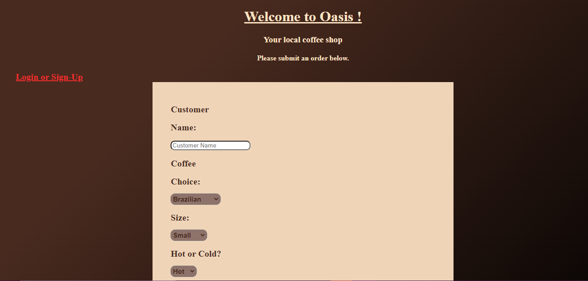

# barista-fullstack-app

This projectdemonstrates an organized and efficient ordering system for a local coffee shop. this app allows users to place their orders with various options, further allowing the baristas to view and complete said orders as they come.

## How It's Made:

**Tech used:** HTML, CSS, JavaScript, Node.js, MongoDb

I utilized my skills in javaScript, HTML and CSS to give a very coffee-shop aura to my project. I also utilized Mongo.Db and Node.js to serve up information sent from a user via form and allowing that data to be sent to a new ejs form.I am able to organize this information with completed and not completed orders.

## Lessons Learned:
I learned to how to sort data using different IDs on orders so a 'barista' could differentiate the like content.